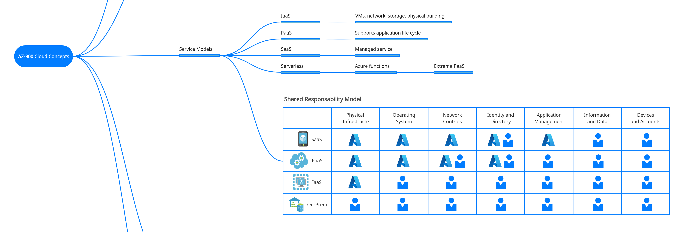

# AZ-900 Microsoft Azure Fundamentals Certification Cheat Sheets

"Azure Fundamentals exam is an opportunity to prove knowledge of cloud concepts, Azure services, Azure workloads, security and privacy in Azure, as well as Azure pricing and support. Candidates should be familiar with the general technology concepts, including concepts of networking, storage, compute, application support, and application development." 

Source: [Microsoft Certifications Website]([Exam AZ-900: Microsoft Azure Fundamentals - Certifications | Microsoft Learn](https://learn.microsoft.com/en-us/certifications/exams/az-900))

## Study Guide

Download the [AZ-900 study guide](https://query.prod.cms.rt.microsoft.com/cms/api/am/binary/RE3VwUY) to help you prepare for the exam.

The English language version of this exam will be updated on October 28, 2022.

## Cheat Sheets Content

Each Cheat Sheet was exported in three different formats (PDF, PNG, and JPG) according to the table of contents below:

1. Introduction

2. Cloud Concepts

3. Azure Architecture

4. Compute

5. Networking

6. Storage

7. Authentication and Authorization

8. Security

9. Privacy, Compliance and Trust

10. Princing
